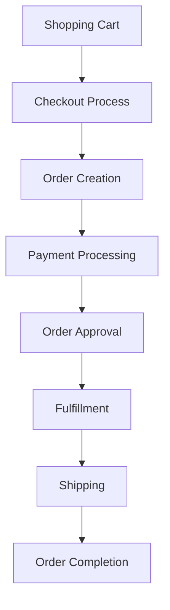

# E-Business/E-Commerce

## Overview

The Apache OFBiz E-Business/E-Commerce module provides a comprehensive, enterprise-grade foundation for building and managing online business operations. Built on OFBiz's robust framework architecture, this module delivers a complete suite of e-commerce capabilities including catalog management, order processing, customer relationship management, and multi-channel sales support.

## Architecture Overview

### Core Components

The E-Business/E-Commerce module follows OFBiz's service-oriented architecture (SOA) and is built around several key components:

```
applications/
├── ecommerce/          # Web storefront application
├── order/             # Order management system
├── product/           # Product catalog management
├── party/             # Customer and vendor management
├── accounting/        # Financial transactions
└── content/           # Content management system
```

### Data Model Architecture

The e-commerce data model is designed around the following core entities:

```java
// Core Product Entity
public class Product extends GenericEntity {
    private String productId;
    private String productTypeId;
    private String productName;
    private String description;
    // Additional fields...
}

// Order Header Entity
public class OrderHeader extends GenericEntity {
    private String orderId;
    private String orderTypeId;
    private String statusId;
    private Timestamp orderDate;
    // Additional fields...
}
```

## Key Features

### 1. Product Catalog Management

#### Product Hierarchy
- **Product Categories**: Hierarchical categorization system
- **Product Variants**: Support for configurable and virtual products
- **Product Associations**: Cross-selling and up-selling relationships
- **Pricing Rules**: Complex pricing strategies and promotional pricing

```xml
<!-- Example Product Definition -->
<Product productId="DEMO_PRODUCT_001" 
         productTypeId="FINISHED_GOOD"
         productName="Demo Product"
         description="Sample product for demonstration"
         isVirtual="N"
         isVariant="N"/>

<ProductCategory productCategoryId="ELECTRONICS"
                 categoryName="Electronics"
                 description="Electronic products category"/>

<ProductCategoryMember productId="DEMO_PRODUCT_001"
                       productCategoryId="ELECTRONICS"
                       fromDate="2024-01-01 00:00:00"/>
```

#### Inventory Management
- Real-time inventory tracking
- Multi-facility inventory support
- Automated reorder points
- Inventory reservation system

```java
// Service for checking product availability
public static Map<String, Object> isStoreInventoryAvailable(DispatchContext dctx, 
                                                           Map<String, ? extends Object> context) {
    Delegator delegator = dctx.getDelegator();
    String productId = (String) context.get("productId");
    String facilityId = (String) context.get("facilityId");
    BigDecimal quantity = (BigDecimal) context.get("quantity");
    
    // Implementation logic for inventory checking
    Map<String, Object> result = ServiceUtil.returnSuccess();
    result.put("availableToPromise", calculateATP(delegator, productId, facilityId));
    return result;
}
```

### 2. Shopping Cart and Order Management

#### Shopping Cart Implementation
The shopping cart is implemented as a session-based object with persistent storage capabilities:

```java
public class ShoppingCart implements Serializable {
    private List<ShoppingCartItem> cartLines;
    private String partyId;
    private String currencyUom;
    private String webSiteId;
    
    public void addOrIncreaseItem(String productId, BigDecimal quantity, 
                                 BigDecimal unitPrice, Map<String, Object> itemAttributes) {
        // Add item to cart logic
    }
    
    public BigDecimal getGrandTotal() {
        // Calculate total including taxes, shipping, promotions
    }
}
```

#### Order Processing Workflow



### 3. Customer Management

#### Customer Registration and Authentication
```groovy
// Customer registration service
def createCustomer() {
    def userLogin = context.userLogin
    def parameters = context.parameters
    
    // Create Party
    def createPartyResult = dispatcher.runSync("createPerson", [
        firstName: parameters.firstName,
        lastName: parameters.lastName,
        userLogin: userLogin
    ])
    
    // Create Customer Role
    dispatcher.runSync("createPartyRole", [
        partyId: createPartyResult.partyId,
        roleTypeId: "CUSTOMER",
        userLogin: userLogin
    ])
    
    return success([partyId: createPartyResult.partyId])
}
```

#### Customer Profile Management
- Personal information management
- Address book functionality
- Order history tracking
- Wishlist and favorites
- Communication preferences

### 4. Payment Processing

#### Payment Method Integration
OFBiz supports multiple payment methods and gateways:

```java
public class PaymentGatewayServices {
    
    public static Map<String, Object> ccAuth(DispatchContext dctx, 
                                            Map<String, Object> context) {
        // Credit card authorization logic
        String paymentGatewayConfigId = (String) context.get("paymentGatewayConfigId");
        BigDecimal processAmount = (BigDecimal) context.get("processAmount");
        
        // Gateway-specific implementation
        Map<String, Object> result = ServiceUtil.returnSuccess();
        result.put("authResult", true);
        result.put("authRefNum", generateAuthReference());
        return result;
    }
}
```

#### Supported Payment Types
- Credit/Debit Cards
- PayPal Integration
- Bank Transfers
- Gift Cards
- Store Credit
- Offline Payments

### 5. Multi-Store and Multi-Channel Support

#### Website Configuration
```xml
<!-- Web Site Configuration -->
<WebSite webSiteId="ECOMMERCE_STORE"
         siteName="Demo E-Commerce Store"
         httpHost="localhost"
         httpPort="8080"
         httpsHost="localhost"
         httpsPort="8443"
         enableHttps="Y"/>

<ProductStore productStoreId="9000"
              storeName="Demo Store"
              companyName="Demo Company"
              title="Demo E-Commerce Store"
              subtitle="Powered by Apache OFBiz"
              defaultCurrencyUomId="USD"
              defaultLocaleString="en_US"/>
```

#### Multi-Channel Architecture
- B2C E-commerce storefront
- B2B customer portals
- Mobile commerce support
- API-based headless commerce
- Point of Sale (POS) integration

## Implementation Guide

### Setting Up E-Commerce Store

#### 1. Initial Configuration

```bash
# Start OFBiz with demo data
./gradlew ofbiz --load-data
./gradlew ofbiz --start
```

#### 2. Store Configuration

Navigate to the Catalog Manager and configure:

```groovy
// Store setup script
def setupStore() {
    // Create product store
    def storeResult = dispatcher.runSync("createProductStore", [
        productStoreId: "DEMO_STORE",
        storeName: "Demo Store",
        companyName: "Demo Company",
        defaultCurrencyUomId: "USD",
        userLogin: userLogin
    ])
    
    // Configure payment methods
    dispatcher.runSync("createProductStorePaymentSetting", [
        productStoreId: "DEMO_STORE",
        paymentMethodTypeId: "CREDIT_CARD",
        paymentServiceTypeEnumId: "PRDS_PAY_AUTH",
        userLogin: userLogin
    ])
    
    return success()
}
```

#### 3. Product Catalog Setup

```xml
<!-- Product Catalog Configuration -->
<ProdCatalog prodCatalogId="DemoCatalog"
             catalogName="Demo Catalog"
             useQuickAdd="Y"
             styleSheet="/images/maincss.css"/>

<ProductStoreCatalog productStoreId="9000"
                     prodCatalogId="DemoCatalog"
                     fromDate="2024-01-01 00:00:00"/>
```

### Customizing the Storefront

#### Theme Customization
```css
/* Custom CSS for storefront */
.product-listing {
    display: grid;
    grid-template-columns: repeat(auto-fill, minmax(250px, 1fr));
    gap: 20px;
    padding: 20px;
}

.product-card {
    border: 1px solid #ddd;
    border-radius: 8px;
    padding: 15px;
    text-align: center;
    transition: box-shadow 0.3s ease;
}

.product-card:hover {
    box-shadow: 0 4px 8px rgba(0,0,0,0.1);
}
```

#### Custom FreeMarker Templates
```html
<!-- product-detail.ftl -->
<div class="product-detail">
    <div class="product-image">
        <#if productContentWrapper.get("PRODUCT_IMAGE_URL", "url")?has_content>
            
        </#if>
    </div>
    
    <div class="product-info">
        <h1>${product.productName!}</h1>
        <div class="price">
            <#if price?has_content>
                ${price.price?string.currency}
            </#if>
        </div>
        
        <form method="post" action="<@ofbizUrl>additem</@ofbizUrl>">
            <input type="hidden" name="productId" value="${product.productId}" />
            <input type="number" name="quantity" value="1" min="1" />
            <button type="submit" class="btn btn-primary">Add to Cart</button>
        </form>
    </div>
</div>
```

### API Integration

#### RESTful Web Services
OFBiz provides REST endpoints for e-commerce operations:

```java
@RestController
@RequestMapping("/api/ecommerce")
public class ECommerceRestController {
    
    @GetMapping("/products")
    public ResponseEntity<List<Product>> getProducts(
            @RequestParam(defaultValue = "0") int page,
            @RequestParam(defaultValue = "20") int size) {
        
        // Service call to get products
        Map<String, Object> serviceResult = dispatcher.runSync("getProductList", 
            UtilMisc.toMap("viewIndex", page, "viewSize", size));
        
        return ResponseEntity.ok((List<Product>) serviceResult.get("productList"));
    }
    
    @PostMapping("/cart/add")
    public ResponseEntity<Map<String, Object>> addToCart(
            @RequestBody CartItemRequest request,
            HttpServletRequest httpRequest) {
        
        ShoppingCart cart = getCartFromSession(httpRequest);
        cart.addOrIncreaseItem(request.getProductId(), 
                              request.getQuantity(), 
                              null, null);
        
        return ResponseEntity.ok(UtilMisc.toMap("success", true));
    }
}
```

## Best Practices

### Performance Optimization

#### 1. Caching Strategy
```java
// Product cache configuration
public class ProductCacheManager {
    private static final String PRODUCT_CACHE = "product.cache";
    
    public static GenericValue getProduct(Delegator delegator, String productId) {
        UtilCache<String, GenericValue> cache = UtilCache.getOrCreateUtilCache(
            PRODUCT_CACHE, 1000, 3600000, true); // 1 hour TTL
        
        GenericValue product = cache.get(productId);
        if (product == null) {
            try {
                product = EntityQuery.use(delegator)
                    .from("Product")
                    .where("productId", productId)
                    .cache(true)
                    .queryOne();
                cache.put(productId, product);
            } catch (GenericEntityException e) {
                Debug.logError(e, "Error getting product: " + productId, MODULE);
            }
        }
        return product;
    }
}
```

#### 2. Database Optimization
- Use entity indexes for frequently queried fields
- Implement proper pagination for large result sets
- Optimize complex queries with views

```xml
<!-- Entity index definition -->
<index name="PRODUCT_STORE_IDX" unique="false">
    <index-field name="productStoreId"/>
    <index-field name="productId"/>
</index>
```

### Security Considerations

#### 1. Input Validation
```java
public static Map<String, Object> validateProductInput(Map<String, Object> context) {
    String productId = (String) context.get("productId");
    BigDecimal quantity = (BigDecimal) context.get("quantity");
    
    List<String> errorMessages = new ArrayList<>();
    
    if (UtilValidate.isEmpty(productId)) {
        errorMessages.add("Product ID is required");
    }
    
    if (quantity == null || quantity.compareTo(BigDecimal.ZERO) <= 0) {
        errorMessages.add("Quantity must be greater than zero");
    }
    
    if (!errorMessages.isEmpty()) {
        return ServiceUtil.returnError(errorMessages);
    }
    
    return ServiceUtil.returnSuccess();
}
```

#### 2. Payment Security
- PCI DSS compliance for credit card processing
- Secure token-based payment handling
- SSL/TLS encryption for all payment transactions

### Testing Strategies

#### Unit Testing
```java
public class ProductServiceTest extends OFBizTestCase {
    
    @Test
    public void testCreateProduct() throws Exception {
        Map<String, Object> serviceContext = UtilMisc.toMap(
            "productId", "TEST_PRODUCT_001",
            "productTypeId", "FINISHED_GOOD",
            "productName", "Test Product",
            "userLogin", getUserLogin()
        );
        
        Map<String, Object> result = dispatcher.runSync("createProduct", serviceContext);
        assertTrue(ServiceUtil.isSuccess(result));
        assertNotNull(result.get("productId"));
    }
}
```

#### Integration Testing
```groovy
// Integration test for order process
def testCompleteOrderProcess() {
    // 1. Add product to cart
    def addToCartResult = dispatcher.runSync("addToCart", [
        productId: "DEMO_PRODUCT_001",
        quantity: 2,
        userLogin: testUserLogin
    ])
    
    // 2. Create order
    def createOrderResult = dispatcher.runSync("createOrderFromCart", [
        userLogin: testUserLogin
    ])
    
    // 3. Process payment
    def paymentResult = dispatcher.runSync("processPayment", [
        orderId: createOrderResult.orderId,
        userLogin: testUserLogin
    ])
    
    assert ServiceUtil.isSuccess(paymentResult)
}
```

## Troubleshooting

### Common Issues

#### 1. Cart Session Issues
```java
// Debug cart session problems
public static void debugCartSession(HttpServletRequest request) {
    HttpSession session = request.getSession();
    ShoppingCart cart = (ShoppingCart) session.getAttribute("shoppingCart");
    
    if (cart == null) {
        Debug.logWarning("Shopping cart not found in session", MODULE);
        // Create new cart
        cart = new ShoppingCart(delegator, productStoreId, webSiteId, locale, currencyUom);
        session.setAttribute("shoppingCart", cart);
    }
    
    Debug.logInfo("Cart items: " + cart.size(), MODULE);
    Debug.logInfo("Cart total: " + cart.getGrandTotal(), MODULE);
}