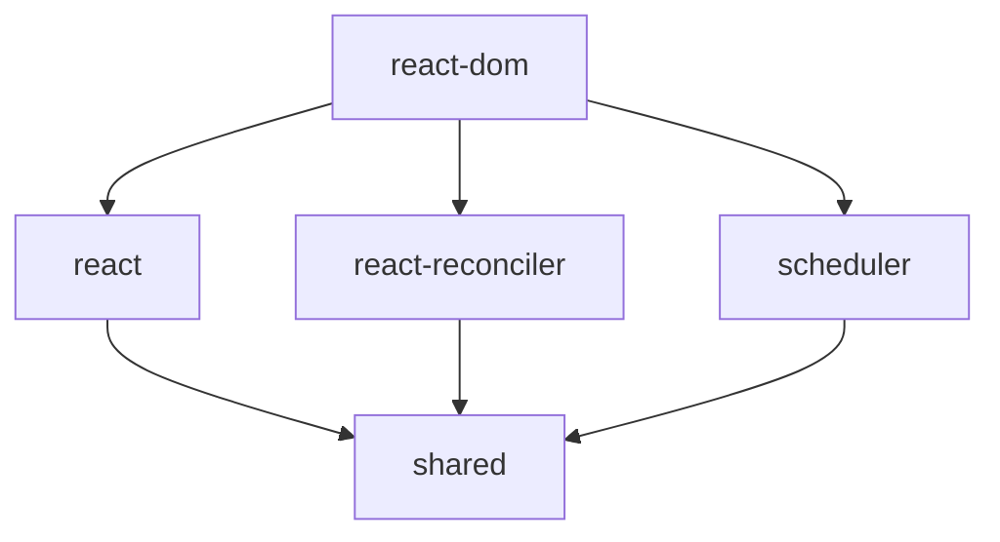

# Core Architecture

React's core architecture is built around a component-based paradigm that emphasizes declarative programming, unidirectional data flow, and efficient DOM manipulation. This architecture enables developers to build complex, interactive user interfaces through the composition of reusable components while maintaining predictable behavior and optimal performance.

The React architecture consists of several interconnected systems that work together to provide a seamless development experience: a well-organized package structure, a sophisticated rendering system with reconciliation algorithms, a synthetic event system for cross-browser compatibility, and a hooks system for state management and side effects.

## Package Structure

React's monorepo architecture is organized into multiple packages, each serving specific purposes within the ecosystem. This modular approach allows for better maintainability, testing, and selective adoption of React features.

### Core Packages

The React repository contains several key packages that form the foundation of the library:

```
packages/
├── react/                 # Core React API and components
├── react-dom/            # DOM-specific rendering logic
├── react-reconciler/     # Core reconciliation algorithm
├── scheduler/            # Task scheduling and prioritization
├── shared/              # Shared utilities and constants
└── react-devtools/      # Development tools integration
```

**React Core (`packages/react/`)**
The main React package contains the public API that developers interact with directly. This includes:

- Component base classes (`React.Component`, `React.PureComponent`)
- Hooks API (`useState`, `useEffect`, `useContext`, etc.)
- Element creation functions (`React.createElement`)
- Context API (`React.createContext`)
- Utility functions (`React.memo`, `React.forwardRef`)

```javascript
// Example of core React API usage
import React, { useState, useEffect } from 'react';

function UserProfile({ userId }) {
  const [user, setUser] = useState(null);
  
  useEffect(() => {
    fetchUser(userId).then(setUser);
  }, [userId]);
  
  return user ? <div>{user.name}</div> : <div>Loading...</div>;
}
```

**React DOM (`packages/react-dom/`)**
The React DOM package handles all DOM-specific operations and serves as the bridge between React's virtual representation and the actual DOM:

- Rendering methods (`ReactDOM.render`, `ReactDOM.createRoot`)
- Server-side rendering utilities
- Event handling integration
- DOM-specific optimizations

**React Reconciler (`packages/react-reconciler/`)**
This package contains the core reconciliation algorithm that determines how to efficiently update the UI when state changes occur. It's designed to be renderer-agnostic, allowing different renderers (DOM, Native, etc.) to use the same reconciliation logic.

### Package Dependencies and Interactions

The packages are designed with clear dependency boundaries:



This structure ensures that:
- Core React logic remains renderer-independent
- Shared utilities are centralized and reusable
- Each package has a single, well-defined responsibility
- Dependencies flow in one direction, preventing circular dependencies

## Rendering System

React's rendering system is built around the concept of a Virtual DOM and a sophisticated reconciliation algorithm that efficiently updates the actual DOM based on component state changes.

### Virtual DOM and Fiber Architecture

React uses a Virtual DOM representation that mirrors the actual DOM structure but exists entirely in memory. The current implementation uses the Fiber architecture, which provides several key advantages:

**Fiber Node Structure**
Each element in the Virtual DOM is represented as a Fiber node containing:

```javascript
// Simplified Fiber node structure
const fiberNode = {
  type: 'div',                    // Component type or HTML tag
  props: { className: 'container' }, // Component props
  child: null,                    // First child fiber
  sibling: null,                  // Next sibling fiber
  return: null,                   // Parent fiber
  stateNode: null,                // Reference to DOM node or component instance
  effectTag: 'UPDATE',            // Type of work to be done
  alternate: null,                // Previous version of this fiber
};
```

**Reconciliation Process**
The reconciliation algorithm compares the current Fiber tree with the previous version to determine the minimal set of changes needed:

1. **Diffing Algorithm**: React compares elements by type and key
2. **Work Scheduling**: Changes are scheduled based on priority
3. **Commit Phase**: DOM updates are applied in a single batch

```javascript
// Example of how React handles component updates
function TodoList({ todos }) {
  return (
    <ul>
      {todos.map(todo => (
        <li key={todo.id} className={todo.completed ? 'done' : 'pending'}>
          {todo.text}
        </li>
      ))}
    </ul>
  );
}

// When todos change, React will:
// 1. Create new Virtual DOM representation
// 2. Compare with previous version
// 3. Identify changed, added, or removed items
// 4. Update only the necessary DOM nodes
```

### Concurrent Rendering

React 18 introduced concurrent rendering capabilities that allow React to interrupt rendering work and prioritize more urgent updates:

**Time Slicing**
React can break rendering work into chunks and yield control back to the browser:

```javascript
// React automatically handles time slicing
function App() {
  const [count, setCount] = useState(0);
  const [items, setItems] = useState([]);
  
  // High priority update (user interaction)
  const handleClick = () => setCount(c => c + 1);
  
  // Lower priority update (data fetching)
  useEffect(() => {
    fetchLargeDataset().then(setItems);
  }, []);
  
  return (
    <div>
      <button onClick={handleClick}>Count: {count}</button>
      <ExpensiveList items={items} />
    </div>
  );
}
```

**Suspense and Error Boundaries**
The rendering system integrates with Suspense for handling asynchronous operations and Error Boundaries for graceful error handling:

```javascript
function App() {
  return (
    <ErrorBoundary fallback={<ErrorMessage />}>
      <Suspense fallback={<LoadingSpinner />}>
        <UserProfile />
        <UserPosts />
      </Suspense>
    </ErrorBoundary>
  );
}
```

## Event System

React implements a synthetic event system that provides consistent behavior across different browsers while maintaining performance and providing additional features.

### Synthetic Events

React wraps native DOM events in SyntheticEvent objects that:
- Normalize behavior across browsers
- Provide consistent API surface
- Enable additional React-specific features
- Pool event objects for performance

```javascript
function Button({ onClick }) {
  const handleClick = (syntheticEvent) => {
    // SyntheticEvent provides consistent interface
    syntheticEvent.preventDefault();
    syntheticEvent.stopPropagation();
    
    // Access native event if needed
    const nativeEvent = syntheticEvent.nativeEvent;
    
    // Call user-provided handler
    onClick(syntheticEvent);
  };
  
  return <button onClick={handleClick}>Click me</button>;
}
```

### Event Delegation

React uses event delegation to optimize performance by attaching a single event listener to the document root rather than individual elements:

```javascript
// React internally handles event delegation
document.addEventListener('click', (nativeEvent) => {
  // React's event handling logic
  const targetFiber = getClosestInstanceFromNode(nativeEvent.target);
  const syntheticEvent = createSyntheticEvent(nativeEvent);
  
  // Traverse up the component tree and call handlers
  traverseAndCallHandlers(targetFiber, syntheticEvent);
});
```

**Benefits of Event Delegation:**
- Reduced memory usage (fewer event listeners)
- Automatic handling of dynamically added/removed elements
- Consistent event ordering and bubbling behavior
- Better performance for applications with many interactive elements

### Event Phases and Propagation

React maintains the standard DOM event propagation model while adding its own enhancements:

```javascript
function EventExample() {
  const handleCapture = (e) => console.log('Capture phase');
  const handleBubble = (e) => console.log('Bubble phase');
  
  return (
    <div onClickCapture={handleCapture} onClick={handleBubble}>
      <button onClick={(e) => console.log('Button clicked')}>
        Click me
      </button>
    </div>
  );
}

// Event flow:
// 1. Capture phase: div handler
// 2. Target phase: button handler
// 3. Bubble phase: div handler
```

## Hooks System

The Hooks system represents a fundamental shift in how React components manage state and side effects, providing a more functional approach to component logic.

### Hook Implementation Architecture

Hooks are implemented using a linked list structure that maintains the order of hook calls across renders:

```javascript
// Simplified hook implementation concept
let currentFiber = null;
let hookIndex = 0;

function useState(initialState) {
  const fiber = currentFiber;
  const hooks = fiber.hooks || (fiber.hooks = []);
  const hook = hooks[hookIndex] || (hooks[hookIndex] = {
    state: initialState,
    queue: []
  });
  
  // Process queued updates
  hook.queue.forEach(update => {
    hook.state = typeof update === 'function' ? update(hook.state) : update;
  });
  hook.queue = [];
  
  const setState = (update) => {
    hook.queue.push(update);
    scheduleUpdate(fiber);
  };
  
  hookIndex++;
  return [hook.state, setState];
}
```

### Built-in Hooks

React provides several built-in hooks for common use cases:

**State Management Hooks**
```javascript
function Counter() {
  // useState for simple state
  const [count, setCount] = useState(0);
  
  // useReducer for complex state logic
  const [state, dispatch] = useReducer((state, action) => {
    switch (action.type) {
      case 'increment':
        return { count: state.count + 1 };
      case 'decrement':
        return { count: state.count - 1 };
      default:
        return state;
    }
  }, { count: 0 });
  
  return (
    <div>
      <p>Simple count: {count}</p>
      <p>Reducer count: {state.count}</p>
      <button onClick={() => setCount(c => c + 1)}>+</button>
      <button onClick={() => dispatch({ type: 'increment' })}>+ Reducer</button>
    </div>
  );
}
```

**Effect Hooks**
```javascript
function UserProfile({ userId }) {
  const [user, setUser] = useState(null);
  
  // useEffect for side effects
  useEffect(() => {
    let cancelled = false;
    
    fetchUser(userId).then(userData => {
      if (!cancelled) setUser(userData);
    });
    
    // Cleanup function
    return () => {
      cancelled = true;
    };
  }, [userId]); // Dependency array
  
  // useLayoutEffect for DOM measurements
  useLayoutEffect(() => {
    const element = document.getElementById('user-profile');
    const rect = element.getBoundingClientRect();
    // Synchronous DOM operations
  });
  
  return <div id="user-profile">{user?.name}</div>;
}
```

### Custom Hooks

Custom hooks enable the extraction and reuse of component logic:

```javascript
// Custom hook for API data fetching
function useApi(url) {
  const [data, setData] = useState(null);
  const [loading, setLoading] = useState(true);
  const [error, setError] = useState(null);
  
  useEffect(() => {
    let cancelled = false;
    
    setLoading(true);
    setError(null);
    
    fetch(url)
      .then(response => response.json())
      .then(data => {
        if (!cancelled) {
          setData(data);
          setLoading(false);
        }
      })
      .catch(err => {
        if (!cancelled) {
          setError(err);
          setLoading(false);
        }
      });
    
    return () => {
      cancelled = true;
    };
  }, [url]);
  
  return { data, loading, error };
}

// Usage in component
function UserList() {
  const { data: users, loading, error } = useApi('/api/users');
  
  if (loading) return <div>Loading...</div>;
  if (error) return <div>Error: {error.message}</div>;
  
  return (
    <ul>
      {users.map(user => (
        <li key={user.id}>{user.name}</li>
      ))}
    </ul>
  );
}
```

### Hook Rules and Best Practices

The Hooks system enforces specific rules to ensure consistent behavior:

1. **Only call hooks at the top level** - Never inside loops, conditions, or nested functions
2. **Only call hooks from React functions** - Components or custom hooks
3. **Use the ESLint plugin** - `eslint-plugin-react-hooks` enforces these rules

```javascript
// ❌ Incorrect hook usage
function BadComponent({ condition }) {
  if (condition) {
    const [state, setState] = useState(0); // Conditional hook call
  }
  
  for (let i = 0; i < 5; i++) {
    useEffect(() => {}); // Hook in loop
  }
}

// ✅ Correct hook usage
function GoodComponent({ condition }) {
  const [state, setState] = useState(0);
  
  useEffect(() => {
    if (condition) {
      // Conditional logic inside effect
      performSideEffect();
    }
  }, [condition]);
}
```

The React core architecture provides a robust foundation for building scalable, maintainable user interfaces. Understanding these architectural principles enables developers to write more effective React applications and contribute to the React ecosystem.

## References

- [React GitHub Repository](https://github.com/facebook/react)
- [React Fiber Architecture](https://github.com/acdlite/react-fiber-architecture)
- [React Hooks RFC](https://github.com/reactjs/rfcs/blob/main/text/0068-react-hooks.md)
- [React Concurrent Features](https://react.dev/blog/2022/03/29/react-v18)